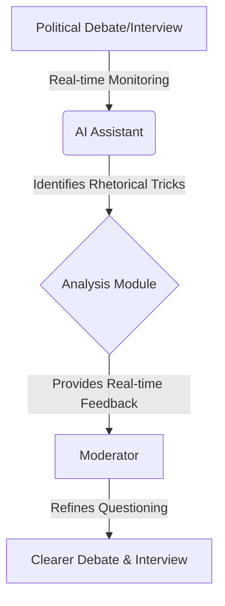
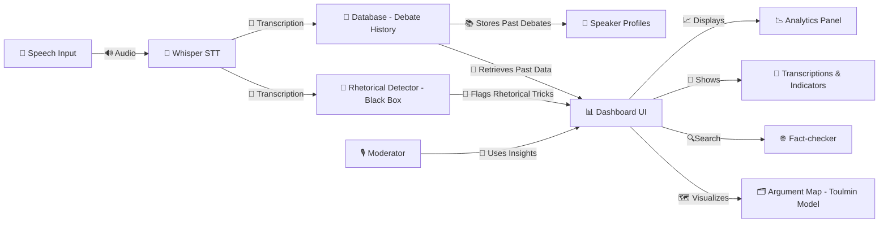

# 📌 **AI Assistant for Moderators and Journalists**

## 🎯 **Project Goal**
We aim to develop an **AI assistant** that helps moderators and journalists enhance the quality and clarity of **political debates and interviews**. The goal is to reduce rhetorical distractions, making discussions more **informative, structured, and honest**. 

## 🛠 **How It Works**

## 🚀 **Innovation Potential**
Unlike existing **fact-checkers**, this AI tool will:  
✅ **Detect rhetorical tricks** like exaggeration, omission, and misdirection 🔍  
✅ **Offer real-time feedback** to help moderators steer discussions back on track ⏳  
✅ **Provide multiple response suggestions** (e.g., varying levels of assertiveness) 🎤  
✅ **Improve over time** through advanced **rhetoric training** and AI fine-tuning 🤖  

## 🌍 **Social Benefit & Scalability**
| Benefit | Impact |
|---------|--------|
| 📡 **Better information quality** | Clearer debates, more factual discussions |
| 🤝 **Encourages honest communication** | Reduces misleading statements |
| 📚 **Educates journalists & public** | Helps people recognize rhetorical tricks |
| 🌱 **Accelerates societal development** | Supports critical decision-making (e.g., green transition) |
| 🌎 **Scalable** | Usable in media, politics, interviews, and even private conversations |

## 🔬 **Feasibility & Prototype Development**

📌 **High feasibility** as core AI technologies already exist 🚀  
📌 **Training data readily available** (political debates, interviews) 🎙️  
📌 **Collaboration with rhetoric experts** for deeper analysis 🏛️  
📌 **Prototype goal:** Deliver meaningful feedback, improving over iterations 🔄  

## 🧠 **AI Relevance**

- **Advanced NLP required** for deep language analysis 📖
- **Real-time processing** needed for live debates ⏳
- **Context memory** (short-term: debate context, long-term: past statements) 🧠
- **Potential multimodal integration** (text, voice, video analysis) 🎥
- **Privacy considerations** for handling recorded statements 🔐

## ⚖️ **Ethical Considerations**
- Bias in existing AI models must be **monitored and mitigated** ⚠️  
- Misuse potential is **low**, but reverse-engineering for misinformation could be a risk 🔄  
- Goal is **transparency and factual accuracy**, benefiting both moderators & the audience 🏆  

---
### **Next Steps & Collaboration**
✅ **Prototype development** with rhetoric experts. 
✅ **Pilot testing with media organizations** (e.g., SVT, WWF policy experts)  
✅ **User feedback & iterative improvements** based on real-world use cases  
